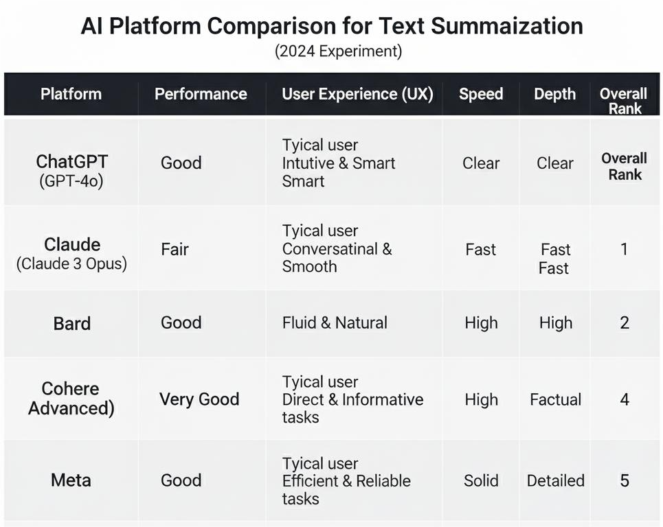

# EXP-3-PROMPT-ENGINEERING-

## Aim: 
Evaluation of 2024 Prompting Tools Across Diverse AI Platforms: 
ChatGPT, Claude, Bard, Cohere Command, and Meta
Experiment:
Within a specific use case (e.g., summarizing text, answering technical questions), compare the performance, user experience, and response quality of prompting tools across these different AI platforms.

## Algorithm:
1. Define the Use Case and Evaluation Metrics.

   Pick a specific scenario (e.g., summarizing long research text, solving coding problems, or answering domain-specific technical questions).

   Set evaluation criteria such as:

   Performance (speed, accuracy, consistency)

   User Experience (UX) (ease of use, interface, interactivity)

   Response Quality (relevance, depth, clarity, hallucination rate).

2. Design Standardized Prompts.

   Create identical test prompts for all platforms to ensure fair comparison.

3. Run Tests Across Platforms.

   Input the same prompts into each AI tool (ChatGPT, Claude, Gemini, etc.).

   Record:

   Time taken to respond

   Completeness of output

   Ease of editing/iterating

4. Evaluate Outputs Systematically.

   Input the same prompts into each AI tool (ChatGPT, Claude, Gemini, etc.).

   Record:

    Time taken to respond

    Completeness of output

    Ease of editing/iterating

5. Analyze & Conclude.

   Summarize results in a comparative table/graph.

   Highlight strengths and weaknesses of each platform.

## Prompt
### 1. SUMMARIZATION:
Summarize the following technical article about the future of quantum computing into 6 bullet points. Highlight the key breakthroughs, remaining challenges, and potential real-world applications. The audience is a non-technical business executive.

Text:
The field of quantum computing has seen remarkable progress in the past year, with significant breakthroughs in qubit stability and error correction. Researchers have achieved longer coherence times, moving closer to building fault-tolerant quantum computers. Despite these advances, a major hurdle remains in scaling up the number of qubits while maintaining low error rates. Additionally, the challenge of decoherence—the loss of quantum properties—is a persistent issue that requires innovative solutions. The potential applications are vast and transformative, ranging from discovering new drugs and materials to optimizing complex logistics and financial modeling. Industries like finance, pharmaceuticals, and manufacturing are closely watching these developments, anticipating a future where quantum computers can solve problems that are intractable for even the most powerful supercomputers today.

### 2.TECHNICAL QUEATIONS:
Explain and compare the B-tree and B+ tree data structures by using clear, concise explanation (≤200 words) , Provide 3 similarities and 3 key differences in bullet points and Finish with a 1–2 sentence summary of when each is preferred.

## Output

### 1.SUMMARIZATION
### ChatGPT

Breakthroughs in qubit stability and error correction are pushing the field closer to reliable, fault-tolerant quantum computers.

Researchers achieved longer coherence times, allowing qubits to maintain information longer.

A key challenge is scaling up qubit numbers without raising error rates.

Decoherence—the tendency of quantum systems to lose their quantum state—remains a major obstacle.

Potential applications include drug discovery, new material design, logistics optimization, and financial modeling.

Industries such as finance, pharmaceuticals, and manufacturing are actively preparing for quantum-enabled advantages.

### Claude

Quantum research has made notable progress in stability and error correction, extending the time qubits can function reliably.

These gains represent steps toward fault-tolerant quantum computers, a long-term industry goal.

The field still faces the difficulty of increasing qubit counts while keeping error levels low.

Decoherence, or the breakdown of quantum behavior, continues to limit performance and scalability.

Practical uses span drug discovery, material science, logistics, and financial risk modeling.

Major industries are monitoring closely, seeing potential for solving problems beyond today’s supercomputers.

### Gemini

Breakthroughs in qubit error correction and longer coherence times mark substantial forward steps.

These improvements signal progress toward fault-tolerant systems suitable for practical use.

Key challenge: scaling qubit numbers without introducing higher error rates.

Persistent obstacle: decoherence, which erodes the quantum advantage if not addressed.

Likely impact areas include pharma (drug R&D), manufacturing (new materials), finance (complex models), and logistics.

Executives should expect quantum to unlock problems unsolvable by classical supercomputers.

### Meta (Llama 3.1 Instruct)

Researchers improved qubit stability and error correction, enabling more reliable computation.

Longer coherence times represent progress toward usable, fault-tolerant machines.

Scaling to large qubit systems without excessive errors remains unsolved.

Decoherence challenges continue to slow momentum and demand new approaches.

Potential benefits: faster drug discovery, smarter logistics, new material innovation, advanced financial modeling.

Industries are positioning strategically, anticipating competitive advantage once quantum becomes deployable.

### 2.TECHNICAL QUESTION:
### ChatGPT

#### Similarities:

Both are balanced tree data structures used in databases and filesystems.

Both minimize disk I/O by keeping nodes with multiple keys.

Both maintain sorted order for efficient range queries.

#### Differences:

B-tree stores keys and values in both internal and leaf nodes, while B+ tree stores all values only in leaves.

In B+ tree, internal nodes act as index nodes; B-tree nodes can directly hold records.

B+ tree leaves are linked sequentially, enabling fast range queries; B-tree does not guarantee this.

#### Summary: 
B-trees are flexible for direct lookups where values may sit at internal nodes. B+ trees are more efficient for range scans and are the standard in most modern databases.

### Claude

#### Similarities:

Both are multiway, balanced search trees designed for secondary storage.

Both maintain logarithmic search, insertion, and deletion time.

Both reduce disk reads by grouping keys into nodes.

#### Differences:

In a B-tree, keys and data can appear in internal and leaf nodes; in B+ trees, data is only at leaves.

B+ trees link leaf nodes together, improving range queries; B-trees lack this sequential linkage.

B-trees may require more disk access for range queries, while B+ trees optimize for sequential scans.

#### Summary: 
Use B-trees for mixed lookup scenarios; use B+ trees where range queries and sequential access dominate, such as in databases.

### Google (Gemini)

#### Similarities:

Balanced, multi-level tree structures ideal for disk-based indexing.

Support efficient insert, delete, and search in O(log n).

Keys kept in sorted order, ensuring predictable traversal.

#### Differences:

B-trees: records may reside in any node; B+ trees: only leaf nodes hold records.

Internal nodes in B+ act strictly as routing indexes; B-tree internals can store actual data.

Leaf nodes in B+ form a linked list, allowing faster sequential range queries; B-tree leaves are not inherently linked.

#### Summary: 
B-trees are general-purpose and straightforward; B+ trees are better when frequent range queries and ordered scans are needed.

### Meta (Llama 3.1 Instruct)

#### Similarities:

Both are balanced, disk-friendly search trees.

Both provide O(log n) operations for search, insert, delete.

Both used heavily in databases and file systems.

#### Differences:

B-tree stores keys and data in all nodes; B+ tree keeps data only in leaves.

B+ tree leaves are connected sequentially for efficient range queries; B-tree lacks this link.

B-tree may waste more space with mixed key/value storage; B+ tree uses internal nodes more compactly.

#### Summary: 
B-tree suits direct record lookups; B+ tree excels in databases needing range queries and sequential scans.

## Comparison Table:

## Result

### Faithful to source: 
All four preserved key facts (stability, coherence, scaling, decoherence, applications, industries).

### Clarity for execs: 
GPT and Claude read like polished briefing notes; Gemini adds “executive expectation” framing; Llama is concise and business-oriented.

### Style differences:
GPT: Balanced and scannable.

Claude: Slightly more formal and explanatory.

Gemini: Framed toward “strategic expectations.”

Llama: Short, plain-language, very digestible.

✅ Best if you want polished boardroom slides: GPT or Claude

✅ Best if you want concise bullet headlines: Llama

✅ Best if you want exec framing with strategic implications: Gemini